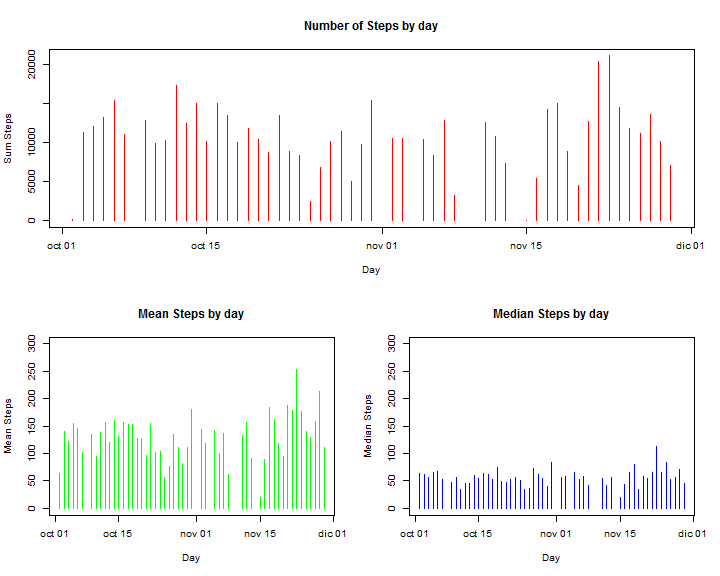
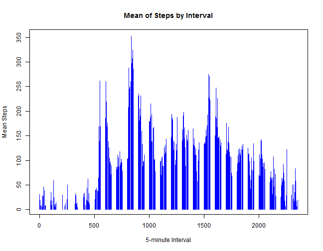

# Reproducible Research: Peer Assessment 1


## Loading and preprocessing the data

```r
library(data.table)

activity <- read.csv("activity.csv", header = TRUE)
DT <- data.table(activity)

DT$steps <- as.integer(DT$steps)
DT$day <- as.Date(activity$date, "%Y-%m-%d")
```


## What is mean total number of steps taken per day?

```r

SSet <- DT[DT$steps != 0, list(sum = sum(steps, na.rm = TRUE), mean = mean(steps, 
    na.rm = TRUE), median = as.double(median(steps, na.rm = TRUE))), by = day]

def.par <- par(no.readonly = TRUE)

layout(matrix(c(1, 1, 2, 3), 2, 2, byrow = TRUE))

plot(x = SSet$day, type = "h", xlab = "Day", y = SSet$sum, ylab = "Sum Steps", 
    col = "red", main = "Number of Steps by day")

plot(x = SSet$day, type = "h", xlab = "Day", y = SSet$mean, ylab = "Mean Steps", 
    ylim = c(0, 300), col = "green", main = "Mean Steps by day")

plot(x = SSet$day, type = "h", xlab = "Day", y = SSet$median, ylab = "Median Steps", 
    ylim = c(0, 300), col = "blue", main = "Median Steps by day")
```

 

```r

par(def.par)
```


## What is the average daily activity pattern?

```r

SSet2 <- DT[DT$steps != 0, list(AvgSteps = mean(steps, na.rm = TRUE)), by = interval]


plot(x = SSet2$interval, type = "h", xlab = "5-minute Interval", y = SSet2$AvgSteps, 
    ylab = "Mean Steps", col = "blue", main = "Mean of Steps by Interval")
```

 


### Average Maximun Number of steps by Interval:

```r
print(SSet2[SSet2$AvgSteps == max(SSet2$AvgSteps)])
```

```
##    interval AvgSteps
## 1:      835    352.5
```

## Imputing missing values
#### Calculate and report the total number of missing values in the dataset (i.e. the total number of rows with NAs)


```r
print(dim(DT[is.na(DT$steps)])[1])
```

```
## [1] 2304
```


## Are there differences in activity patterns between weekdays and weekends?
